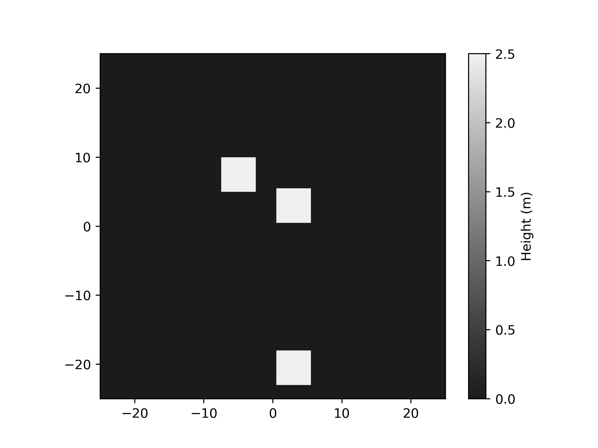

# artificial_terrain

A library and script for creating artificial terrains, represented as npz files with a height array and size/extension tuple.
Terrains can be created by calling the script, or by combining functions in a custom python script.
The script executes an ordered list of specified 'datahandlers', to create and combine terrain buidling blocks to (more or less) realistic terrains.

The repo is still under development. Script names and other names can/will change.

## Getting started
The following command creates a terrain with an overall ground-shape generated from a `WeightedSum` of different simplex noise `Octaves`. `Holes` and `Rocks` of different scale are generated and combined with a `Min` and `Max` operation respectivly. The resultant ground, holes, and rocks are `Combined` with a default Add operation, and the result is `Save`d and `Plot`ted in the folder Result.
```
python run.py --datahandlers Holes Combine:Min Octaves WeightedSum Rocks Combine:Max Combine Save:Result Plot:Result --save-dir Terrains/test_001a/
```

Alternativly, the same command can be run by
```
python run.py --settings-file settings.yml
```
with settings specified in a yaml file,
```yaml
save-dir: runs/data_001a
datahandlers:
- Holes
- [Combine, Min]
- Octaves
- WeightedSum
- Rocks
- [Combine, Max]
- Combine
- [Save, Result]
- [Plot, Result]
```
In all runs, a copy of the used settings is saved in `settings.yml`, and commands and prints are appended to `logger.txt`.

## Datahandlers
The overall setup for creating a terrain is to create 'terrain basics', and combine them in different ways.

We can split the datahandlers in some main categories. Two fundamental such is 'generating' and 'combining'. The 'generating' generate 'terrain basics', and the 'combining' combine these basics into more complex terrains. Some datahandlers alter the general 'settings' (e.g. size and resolution), and some do 'input/output' (e.g. save terrains and plot).

### Pipes
Datahandlers are called in order, and the output of one datahandler is passed as input to the next, as if connected along a 'pipe'. This makes it possible to generate a multitude of terrain of different types and complexities using basic building blocks.

It is also possible to run parallel pipes to generate a number of terrains.

### 'Primary' and 'temporary' terrain heaps
In order to combine basic building blocks to more complex results, and in turn combine these and so on, we utilize two entities for storing sub-results, the 'primary heap' and the 'temporary heap'.
Generated terrain basics are placed in the `temporary heap`. 
If a 'combining' datahandler is run, it primarily operates on the content of the 'temporary heap', with the result appended to the 'primary heap'.
If the 'temporary heap' is empty, the 'combining' datahandler operates on the 'primary heap' instead.

### Generating from noise
| Technique | Description | Input arguments| Output |
|-----------|-------------|-------|-------|
| **Octaves** | Generate a list of 'terrain basics' (default=10) from random noise with increasing scale factor. Additionally passes a `weights` list which can be used by `WeightedSum` to combine the 'terrain basics' to a more complex terrain. | `num_octaves=10` <br /> `start=128` <br /> `persistance=0.6` <br /> `amplitude_start=10` <br /> `random_amp=0.5` |  <br /> `weights=amplitude_list` |
| **Basic** | Generate a list of 3 'terrain basics' with a large, medium, small scale factor from random noise. | |  |
| **Rocks** | Generate a list of 'terrain basics' (default=4) representing rocks from random noise. | `rock_size=[0.5,1,2,4]` <br /> `rock_heights=None` <br /> `fraction=0.8` |  |
| **Holes** | Generate a list of 'terrain basics' (default=4) representing holes from random noise. | `size_list=[0.5,1,2,4]` <br /> `fraction=0.8`  |  |

### Combining
| Technique | Description | Input arguments | Example input| Output |
|-----------|-------------|----------------|---------------|--------|
|**Combine**| Combines the (entire by default) content of the 'temporary heap' (primarily) or the 'primary heap' (secondarily) using a mathematical operation e.g. (add, min, max, prod). | `operation='add'`  <br /> `last=None` |  | `Combine:add`  <br /> `Combine:max`  <br /> `Combine:min`  <br /> `Combine:prod`
|**CombineLast**| As Combine, but only work on the last 2 terrains in the 'temporary' or primary heap. (note that this is a shortcut, and the option `last=X` can be passed to `Combine` for the more general case of combining the last X terrains) | `operation='add'` |  |
|**WeightedSum**| Add the content of the 'temporary heap' as a weighted sum. The input `weights` must match the length of the 'temporary heap'.| `weights=[5,8,0.1]` |  |  | 


### Other?
| Technique | Description | Image |
|-----------|-------------|-------|
| **Size** | Set the physical size of the terrain (the size and resolution is determined by two of the three parameters [size, resolution, point-per-meter]) | |
| **Resolution** | Set the 'resolution', the number of values in each dimension (the size and resolution is determined by two of the three parameters [size, resolution, point-per-meter]) | |
| **PPM** | 'points-per-meter'. (the size and resolution is determined by two of the three parameters [size, resolution, point-per-meter]) | |
| **Seed** | Set random seed | |
| **Folder** | Set folder, affects eg. 'Save' and 'Plot' and other datahandlers where a 'folder' is given as input | |
| **Set** | Set parameter value as `Set:parameter=value` | |
| **SetDistribution** | Set distribution as `SetDistribution:parameter=distribution[*args]`. Both square and rounded parenthesis can be used. In bash, rounded parameter must either be 'escaped' (as  `SetDistribution:parameter=distribution\(*args\)`), or placed within quotation marks (as `SetDistribution:'parameter=distribution(*args)'` | |


### Obstacles?
| Technique | Description | Input | Example 1 | Example 2 | Example 3 | Example 4 |
|-----------|-------------|-------|-------|-------|-------|-------|
| MakeObstacles | MakeObstacles | | `MakeObstacles` <br />  |
| LoadObstacles | LoadObstacles | | | 
| Random | Random | `number_of_values` <br /> `position_distribution` <br /> `height_distribution` <br /> `yaw_deg_distribution` <br /> `width_distribution` <br /> `aspect_distribution` <br /> `pitch_deg_distribution` <br /> `position_distribution_2d` | `Random:10` <br />   | `Random:position` <br />  | `Random:[position,yaw_deg]` <br />  |`Set:number_of_values=10 Random:[position,yaw_deg]` <br />  |


### Generating from functions
| Technique | Description | Input | Basic output | Combined output |
|-----------|-------------|-------|---|----|
| **Gaussian** | Gaussian | `position` <br /> `height` <br /> `yaw_deg` <br /> `width` <br /> `aspect` <br /> ~~`pitch_deg`~~ |  `Gaussian` <br />  | `Random:10 Gaussian Combine:Max` <br />  |
| **Step** | Step| `position` <br /> `height` <br /> `yaw_deg` <br /> ~~`width`~~ <br /> ~~`aspect`~~ <br /> ~~`pitch_deg`~~  | `Step` <br />  | `Random:10 Step Combine:Max` <br />  |
| **Donut** | Donut| `position` <br /> `height` <br /> `yaw_deg` <br /> `width` <br /> `aspect` <br /> ~~`pitch_deg`~~  | `Donut` <br />  | `Random:10 Donut Combine:Max` <br />  |
| **Plane** | Plane| ~~`position`~~ <br /> ~~`height`~~ <br /> `yaw_deg` <br /> ~~`width`~~ <br /> `aspect` <br /> `pitch_deg`  | `Plane` <br />  | `Random:10 Plane Combine:Max` <br />  |
| **Sphere** | Sphere| `position` <br /> `height` <br /> `yaw_deg` <br /> `width` <br /> `aspect` <br /> ~~`pitch_deg`~~  | `Sphere` <br />  | `Random:10 Sphere Combine:Max` <br />  |
| **Cube** | Cube| `position` <br /> `height` <br /> `yaw_deg` <br /> `width` <br /> `aspect` <br /> ~~`pitch_deg`~~  | `Cube` <br />  | `Random:10 Cube Combine:Max` <br />  |
| **SmoothStep** | SmoothStep| | `SmoothStep` <br />  | `Random:10 SmoothStep Combine:Max` <br />  |
| **Sine** | Sine| ~~`position`~~ <br /> `height` <br /> `yaw_deg` <br /> `width` <br /> ~~`aspect`~~ <br /> ~~`pitch_deg`~~  | `Sine` <br />  | `Random:10 Sine Combine:Max` <br />  |


### Modifiers
| Technique | Description | Image |
|-----------|-------------|-------|
|**BezierRemap**| Modify heights using a nonlinear mapping. Like the 'combining' datahandlers, it operates primarily on the 'temporary heap', secondarily on the 'primary heap', and can take a `last` parameter to limit itself to the last X terrains. ||
|**Negate**| Negate ||


### Settings


### Input/output
| Technique | Description | Input |
|-----------|-------------|-------|
| Save | Save terrains | `folder='Save'` (default) <br /> `filename='terrain.npz'`  |
| Plot | Plot terrains | |


### Other
| Technique | Description | Input |
|-----------|-------------|-------|
|**Hypercube**| Split into a number of pipes, and generate different `weights` to combine the terrain basics from `Basic` differently.| |
| **Exit** | Exit early  |   |   | 
| **Print** | Print information of pipe  |   |   | 


### Examples
Examples of different combinations of datahandlers and the resultant terrains. Only the relevant datahandlers are listed in the table, and not the full command to generate the terrain/rendered images. However, these commands can be found below the table. In some cases, alternative (equivalent or almost equivalent) formatting are shown. Most of the terrains/images are generated by a single command, but some might require two or more.

| #| Description | Datahandlers | Output |
|-|------------|-------|-------|
| 1 | Sloped plane with grooves. Adding an angled plane to a sine plane | `Set:width=10 Sine Random:1 Plane Combine` **or** <br /> `Sine:"dict(width=10)" Plane:"dict(pitch_deg=10)" Combine:Add` |   |
| 2|  Walls along the perimiter. Negating a large cube. | `Set:width=45 Cube Negate` **or** <br /> `Cube:"dict(width=45)" Negate`|  |
| 3 | Moon landscape. Combine multiple 'donuts' using a pointwise max, and adding to a large sphere | `Random:20 Donut Combine:Max Set:width=500 Sphere ToPrimary Combine:Add` |  |
|4 | Stone circle. Interpret a large donut as a positional probability, and setup a constant width-distribution. Draw 30 random samples to generate cube-terrains in the temporary list, and combine using pointwise max.  | `Donut:"dict(width=35)" AsProbability SetDistribution:width=uniform[2,2] Random:30 Cube Combine:Max` |  |
| 5| Stone circle with obj-file stones. Increase resolution to 10 points-per-meter. Make a flat terrain, and use to make a blender-ground. Sample points along a circle as above, and use to add rocks in blender. Generate Depth image and save. | `PPM:10 Plane Ground Donut:"dict(width=35)" AsProbability SetDistribution:width=uniform[2,2] Random:30 AddRocks Depth Save` |  |
| 6 | Terrain from noise, combined with step function  |  `Octaves WeightedSum Random:2 Step Combine:Max Combine:Add` |  |
| 7 | Load from saved 'octaves' and combine using random weights  | `PPM:10 Octaves Save:Octaves` **then** `Load:runs/data_030/Octaves Random:weights WeightedSum` |  |
| 8 | Load from saved octaves, and add unevenly spaced rocks. We use the combination of some 'Basic' terrains to get a 2d position probability, and add 10 obj-file rocks in blender.   | (Assumes first step from 7) `Load:runs/data_030/Octaves Random:weights WeightedSum Ground Basic Combine:Add AsProbability Random:10 AddRocks Depth Save` |  |


#### Full commands to make terrains, plot, and save as numpy npz files
```
# 1
python run.py --save-dir runs/data_030 --settings overwrite:True --datahandlers Sine:"dict(width=10)" Plane:"dict(pitch_deg=10)" Combine:Add Folder:02_angled_sine_plane Plot Save
# 2
python run.py --save-dir runs/data_030 --settings overwrite:True --datahandlers Set:width=45 Cube Negate Folder:01_wall Plot Save

# 6
python run.py --save-dir runs/data_030 --settings overwrite:True --datahandlers Octaves WeightedSum Random:2 Step Combine:Max Combine:Add Folder:06_terrain_with_step Plot Save
# 7
python run.py --save-dir runs/data_030 --settings overwrite:True --datahandlers PPM:10 Octaves Save:Octaves
python run.py --save-dir runs/data_030 --settings overwrite:True --datahandlers Load:runs/data_030/Octaves Random:weights WeightedSum Folder:07_generate_and_load Plot Save
# 8
blender --python blender.py -- --save-dir runs/data_030 --settings overwrite:True --datahandlers Load:runs/data_030/Octaves Random:weights WeightedSum Ground Basic Combine:Add AsProbability Random:10 AddRocks Folder:08_unevenly_spaced_rocks PPM:10 Camera:top Depth Save
```


#### Full commands to make the above rendered images
```
# 1
blender --python blender.py -- --save-dir runs/data_030 --settings overwrite:True --datahandlers Sine:"dict(width=10)" Plane:"dict(pitch_deg=10)" Combine:Add Folder:02_angled_sine_plane Plot Save Ground ColorMap:dimgray Camera:angled Holdout Render Exit
# 2
blender --python blender.py -- --save-dir runs/data_030 --settings overwrite:True --datahandlers Set:width=45 Cube Negate Folder:01_wall Plot Save Ground ColorMap:dimgray Camera:angled Holdout Render Exit

# 6
blender --python blender.py -- --save-dir runs/data_030 --settings overwrite:True --datahandlers Octaves WeightedSum Random:2 Step Combine:Max Combine:Add Folder:06_terrain_with_step Plot Save Ground ColorMap:dimgray Camera:angled Holdout Render
# 7
python run.py --save-dir runs/data_030 --settings overwrite:True --datahandlers PPM:10 Octaves Save:Octaves
blender --python blender.py -- --save-dir runs/data_030 --settings overwrite:True --datahandlers Load:runs/data_030/Octaves Random:weights WeightedSum Folder:07_generate_and_load Plot Save Ground ColorMap:dimgray Camera:angled Holdout Render
# 8
blender --python blender.py -- --save-dir runs/data_030 --settings overwrite:True --datahandlers Load:runs/data_030/Octaves Random:weights WeightedSum Ground Basic Combine:Add AsProbability Random:10 AddRocks Folder:08_unevenly_spaced_rocks PPM:10 Camera:top Depth Save
blender --python blender.py -- --save-dir runs/data_030 --settings overwrite:True --datahandlers Load:runs/data_030/08_unevenly_spaced_rocks/terrain_00000.npz Ground Folder:08_unevenly_spaced_rocksb Plot Save Ground ColorMap:dimgray Camera:angled Holdout Render
```


### Blender
The script `blender.py` enables using blender via its python interface. All the above datahandlers work with this script as well, and additionally a number of specific datahandlers, listed below.
To run the blender script, the following command is used in place of `python run.py`: `blender --python blender.py --`. Note the final `--`, which states that any following arguments are passed to the script `blender.py` (and not the actual blender software). An example run, producing an angled plane with sine grooves:
```
blender --python blender.py -- --save-dir runs/data_001/ --datahandlers Sine Random Plane Combine Ground
```

| Technique | Description | Input | Output |
|-----------|-------------|-------|-------|
| **Ground** | Create grid, using either a terrain from a specified file, or the latest terrain in the primary or temporary heaps | `filename=None` | `Ground` <br />  | 
| **ColorMap** | Color heightfield using colormap  | ~~`cmap='viridis'`~~  |  `Ground ColorMap` <br />  | 
| **AddRocks** | Add rocks to scene.   |   `position` <br /> ~~`height`~~ <br /> `yaw_deg` <br /> `width` <br /> ~~`aspect`~~ <br /> `pitch_deg` | `Ground Random:10 AddRocks` <br />  | 
| **ImageTexture** | Color heightfield using image texture file  | `filename=None`  |  `Ground ImageTexture:image_texture.png` <br />  | 
| **Render** |   |   | `Ground Random:10 AddRocks Render` <br />  | 
| **RenderSegmentation** |   |  |  `Ground Random:10 AddRocks RenderSegmentation` <br />  | 
| **Depth** | Generate depth image. This also returns a 'terrain', but this will only be resonable together with the `Camera:top` command, see below.  |   | `Ground Random:10 AddRocks Depth` <br />  | 
| **Camera** | Setup camera. Takes either 'angled' or 'top' as input  |   | `... Depth:top` <br />  | 
| **GenericCamera** |   |   |   | 
| **Holdout** | Add a large 'holdout plane' at height -100 m, which gives a transparent background in generated images.  |   |   | 
| **BasicSetup** | Clean and setup basic blender scene. NOTE: Runs by default as the first datahandler.  |   |   | 


## Dependencies
In order to be able to run, the following python packages should be installed.
```
python -m pip install opensimplex
python -m pip install PyYaml
python -m pip install matplotlib
python -m pip install colorcet
```


## Settings file
The options in the settings can be specified with different formatting. The `datahandlers` is a list of 2-tuples/lists `(datahandler-name, options)`. The following contains 4 examples of equivalent formatting.
```yaml
datahandlers
# Version 1, default formatting
- - Donut
  - position:
    - 10
    - 10
    height: 5

# Version 2, position list on one line
- - Donut
  - position: [10, 10]
    height: 5

# Version 3, options as a one line dict
- - Donut
  - {position: [10, 10], height: 5}

# Version 4, [name, options] on one line
- [Donut, {position: [10, 10], height: 5}]
```
In each run, the used settings are saved to `<save_dir>/settings.yml`.


## Extending
The setup is modular and new 'datahandlers' can easiliy be added, as e.g.
```
class NewDatahandler(DataHandler):
    ''' A new datahandler '''
    @debug_decorator
    def __call__(self, terrain=None,
                 default=None,
                 overwrite=False,
                 **_):
```
This inherits from the `DataHandler` base class, which sets up e.g. logging and `self.save_dir`. The latter is a folder given by appending the datalogger name to the  `--save-dir` arg. The new datahandler is setup by defining the `__call__` method. As a datahandler is run, this method is executed, with the `pipe` given as keyword arguments. The `default` argument is special. If a single value/string is passed as options for the datahandler, e.g. `Random:10` or `Load:folder/terrain.npz`, then this is passed as the 'default' value. 
Two other special arguments are `call_number` and `call_total` which are important if there are multiple parallel pipes, where each datahandler will be called multiple times.
Otherwise the keyword arguments are given py the pipe, or by specifying a dict input to the datahandler, as e.g. `Gaussian:"dict(position=[10,10],height=3,width=10)"`

The above example takes a `terrain` keyword as input, with the idea of this being passed in the 'pipe' from a previous datahandler, e.g. `Load` or some 'generating' datahandler. Anything can be passed between datahandlers in this way, and the names are arbitrary. Some special are the following,
[Note that these are the current names and this might/will change after some clean up]
| Name | Description |
|-----------|-------------|
| `terrain_heap` | The primary heap |
| `terrain_dict` | The temporary heap |
| `position`, `height`, `yaw_deg`, `width`, `aspect`, `pitch_deg` | Parameterisation of generation functions, obstacles etc. in a common interface |
| `size`, `resolution`, `ppm` | Parameterisation of the terrain size and resolution, determined by specifying two of the three. |
| `weights` | A list of weights, which is currently used by `WeightedSum` to combine different basics to a terrain |

The `return` from a datahandler is collected, in order to allow passing information between datahandlers. The typical return type is a `dict`. It is used to update the pipe, after which any `None` type values are removed from the pipe. If a `list` (of pipes) is the return, then this extends to 'split' into multiple parallel pipes. On the other hand, passing the string `'remove'` removes the pipe, and can e.g. be used when merging multiple pipes into one.


Sometimes is can be of use to handle the entire 'pipe' in the datahandler.
```
    def __call__(self, operation='Add', terrain_dict={},
                 default=None, call_number=None, call_total=None,
                 last=None, **pipe):

        ...
	return pipe

```
`pipe` is then a dict containing all items in the pipe, except any already specified as input kwargs. If the pipe is later returned, it is of importance that `call_number` and `call_total` are included as arguments, as these otherwise will be passed to the next datahandler which is not the idea (and might/will give rise to error).
